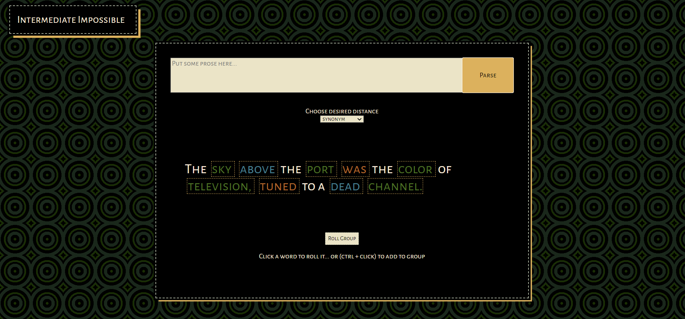

# intermediate-impossible
Spark new prose ideas by generating random-but-adjacent words within context.

## Inspiration
One of John Cleese's go-to techniques to spark creativity is what he calls the "intermediate impossible" -- a solution/idea that is unbound by any logic or relation to the actual problem at hand. Of course, thinking this way mostly results in impossible solutions. But they are not meant to be used, they are meant to spark engagement with the problem in a different direction than straightforward thinking would have. That thinking then breeds the real solutions, and more various ones than straightforward thinking would have. The impossible solutions are only temporary intermediates.

This tool applies that idea to prose writing. Feed it a sentence you're having trouble pinning down, and roll the key words of that sentence into other words. The words can be relatively close to the root word, or much further, but still with a string of relation. 